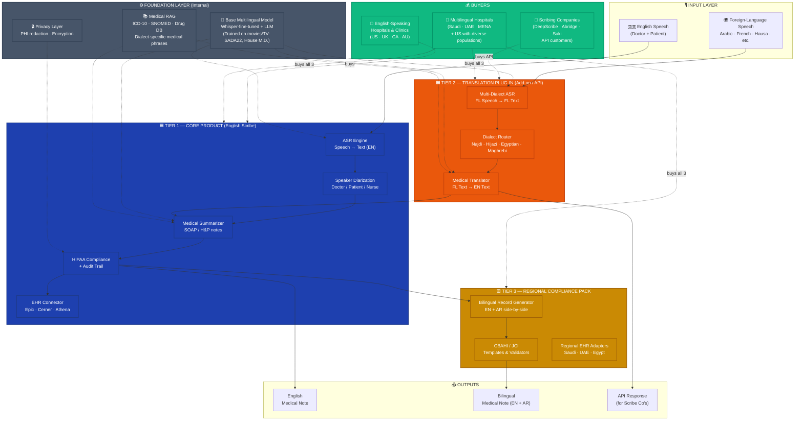
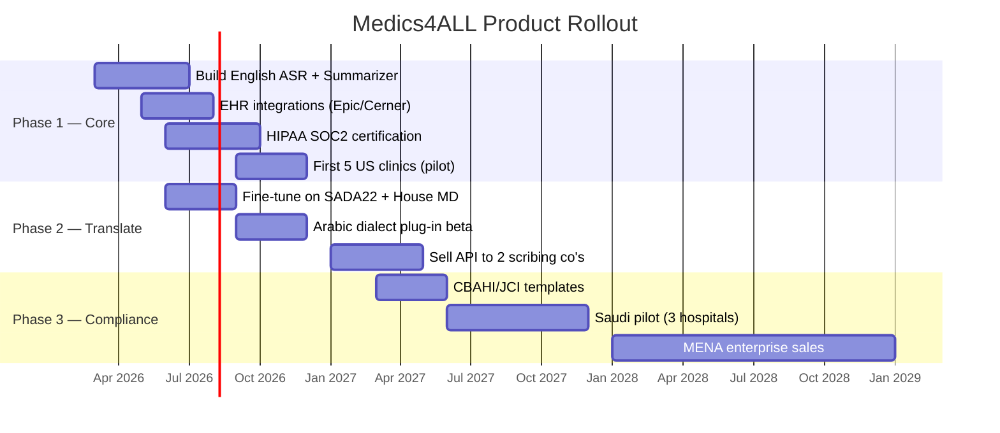

# Medics4ALL — Modular Architecture & Business Plan

> A layered AI medical scribing platform: sell the **Core** to English-speaking hospitals, sell the **Translation Add-ons** to scribing companies and multilingual healthcare systems.

---

## 📚 Companion Documents

| Document | Audience | Purpose |
|---|---|---|
| **This file** | Investors, founders, strategy | Architecture overview + business model |
| [`medics4all_architecture_diagram.png`](./medics4all_architecture_diagram.png) | Pitch decks, investors | Presentation-grade visual of the layered architecture |
| [`medics4all_technical_roadmap.md`](./medics4all_technical_roadmap.md) | Engineers, CTO, technical hires | 9-month build plan for Core MVP, stack, costs, team |
| [`medics4all_competitive_analysis.md`](./medics4all_competitive_analysis.md) | Sales, BD, marketing | Pricing & feature comparison vs. DeepScribe / Abridge / Suki / Nabla / Nuance DAX, with battlecards |

---

## 1. Strategic Thesis

**Build once, monetize many times.** Each layer of the stack has its own buyer, its own pricing, and its own competitive moat. This is the same playbook as Stripe (Payments → Issuing → Atlas) or Twilio (SMS → Voice → Email).

| Layer | Product | Primary Buyer | Pricing Model |
|-------|---------|---------------|---------------|
| **Tier 1 — Core** | Medics4ALL Scribe (English) | US/UK/EU hospitals & clinics | Per-provider/month SaaS |
| **Tier 2 — Translation** | Multilingual Plug-in | Scribing companies (B2B API) + multilingual hospitals (add-on) | Per-encounter API + seat license |
| **Tier 3 — Compliance** | Regional Compliance Pack | Saudi/Gulf/MENA hospitals (CBAHI/JCI) | Annual enterprise license |
| **Foundation** | Medical RAG + Base Model | Internal — powers all tiers | (Cost center) |

---

## 2. Clean Architecture Diagram

---

## 3. Product SKUs (What You Actually Sell)

### 🟦 SKU 1 — **Medics4ALL Core** (English Scribe)
- **Target buyer**: US/UK/EU hospitals, private clinics, telehealth platforms
- **What's included**:
  - Real-time English ASR + speaker diarization
  - SOAP / H&P note generation
  - EHR integration (Epic, Cerner, Athena, eClinicalWorks)
  - HIPAA-compliant storage + audit trail
- **Pricing**: **$199–$499 / provider / month**
- **Competes with**: DeepScribe ($349/mo), Abridge ($250+/mo), Suki ($300/mo), Nuance DAX
- **Differentiator**: Lower price + open API + dialect-ready foundation (future-proof)

### 🟧 SKU 2 — **Medics4ALL Translate** (Multilingual Plug-in)
- **Target buyer A**: Scribing companies who don't have multilingual capability (white-label API)
- **Target buyer B**: Multilingual hospitals as an **add-on** to Core
- **What's included**:
  - 15+ Arabic dialects (Najdi, Hijazi, Egyptian, Levantine, Maghrebi…)
  - French, Spanish, Hausa, Swahili, Mandarin (Phase 2)
  - REST API + WebSocket for real-time
  - Dialect auto-detection
- **Pricing**:
  - **API**: $0.05–$0.15 per minute of audio (volume-tiered)
  - **Hospital add-on**: +$99 / provider / month on top of Core
  - **White-label license**: $50K–$500K / year for scribing companies
- **Differentiator**: **Only product on the market that handles regional Arabic dialects in medical context.** This is your moat.

### 🟨 SKU 3 — **Medics4ALL Compliance** (MENA/Gulf Pack)
- **Target buyer**: Saudi, UAE, Qatar, Egypt hospital systems
- **What's included**:
  - Bilingual (Arabic + English) medical records
  - CBAHI templates (Saudi accreditation)
  - JCI compliance validators
  - Local EHR adapters (Cerner Saudi, Trakcare, etc.)
  - Arabic-language patient summaries
- **Pricing**: **$50K–$250K / hospital / year** (enterprise)
- **Differentiator**: Local regulatory expertise — hard for US competitors to replicate.

### ⚙️ Foundation Layer (Internal — Not Sold)
- Base multilingual model (your IP, fine-tuned on SADA22 + medical content)
- Medical RAG database (curated, regularly updated)
- Privacy/encryption layer
- **This is your competitive moat.** Don't license it directly — license the products built on top.

---

## 4. Go-to-Market Sequence

### Why this order?
1. **Core first** = fast revenue, proves the AI works, builds trust with US investors and hospitals
2. **Translate second** = leverages the **same base model** (no new R&D), but opens a brand-new market that competitors can't follow
3. **Compliance third** = highest-margin enterprise deals, but only viable once Core + Translate are proven

---

## 5. Revenue Model & Unit Economics

### Year 1 Target (Conservative)

| SKU | Customers | Avg ACV | Revenue |
|-----|-----------|---------|---------|
| Core (Tier 1) | 50 providers | $4,200/yr | $210K |
| Translate API (Tier 2) | 1 scribing co. | $100K/yr | $100K |
| Compliance (Tier 3) | 0 (still in dev) | — | — |
| **Total Year 1 ARR** | | | **$310K** |

### Year 3 Target

| SKU | Customers | Avg ACV | Revenue |
|-----|-----------|---------|---------|
| Core | 2,500 providers | $4,800/yr | $12M |
| Translate add-on | 800 providers | $1,200/yr | $1M |
| Translate API (B2B) | 5 scribing co's | $250K/yr | $1.25M |
| Compliance (MENA) | 8 hospitals | $150K/yr | $1.2M |
| **Total Year 3 ARR** | | | **$15.45M** |

---

## 6. Why Each Buyer Buys

### 🏥 US/UK English-Speaking Hospital → Buys **Core only**
- **Pain**: Doctors burnt out on documentation (40% of time on paperwork)
- **Why us over DeepScribe**: Cheaper, open API, owns multilingual future
- **Sales cycle**: 3–6 months (department-level pilot → CMO buy-in)

### 🏢 Scribing Company (DeepScribe, Abridge competitor) → Buys **Translate API**
- **Pain**: Their customers ask for Arabic/multilingual support, they don't have it
- **Why us**: Faster than building it themselves; we white-label so it looks like their feature
- **Sales cycle**: 6–12 months (technical eval → revenue share negotiation)

### 🏥 Saudi/Gulf Hospital → Buys **Core + Translate + Compliance**
- **Pain**: CBAHI mandates bilingual records; expat doctors can't speak Saudi dialect; interpreters cost $300/session
- **Why us**: Only solution on the market for their exact problem
- **Sales cycle**: 9–18 months (Ministry of Health approval → flagship hospital pilot → expansion)

---

## 7. Competitive Moat — Why This Wins

| Layer | Moat Type | How Strong |
|-------|-----------|------------|
| Base multilingual model | **Data moat** (SADA22 fine-tune + proprietary medical-dialect corpus) | 🟢 Strong |
| Medical RAG | **Knowledge moat** (curated medical terminology DB across dialects) | 🟢 Strong |
| EHR integrations | **Integration moat** (every new EHR is months of work) | 🟡 Medium |
| Compliance (CBAHI/JCI) | **Regulatory moat** (US competitors won't bother for 5–10 years) | 🟢 Strong |
| Brand in MENA | **Trust moat** (Arabic-first product built by Arabic-speaking team) | 🟢 Strong |

---

## 8. Two Critical Investments (From Whiteboard)

### Investment 1 — Train base on Public General Language (movies/TV)
- **Datasets**: SADA22 (667 hrs Saudi TV), Common Voice, House M.D. dubs, Grey's Anatomy Arabic
- **Why**: General conversational fluency is the foundation — you can't fix bad ASR with RAG
- **Cost estimate**: $50K–$150K (compute + data engineering)

### Investment 2 — RAG for Medical Terminology
- **Sources**: ICD-10, SNOMED-CT, RxNorm, MeSH, dialect-specific medical dictionaries
- **Why**: Medical terms are the **highest-stakes** part of the transcript — getting "diabetes" vs "elevated blood glucose" wrong is a malpractice risk
- **Cost estimate**: $30K–$80K (curation + vector DB infra)

**Total foundational R&D**: ~$80K–$230K → unlocks **all three product tiers**.

---

## 9. Pitch One-Liners (For Different Audiences)

- **To US hospitals**: *"Cut documentation time by 70% with the AI scribe that's also future-proof for your diverse patient population."*
- **To scribing companies**: *"Add multilingual support to your platform in 30 days, not 3 years."*
- **To Saudi hospitals**: *"The first AI scribe that actually understands Saudi dialect — and meets CBAHI requirements out of the box."*
- **To investors**: *"DeepScribe for the 80% of the world that doesn't speak English."*

---

## 10. Next Steps

1. **Lock in the Core product MVP** (Phase 1 — English scribe with one EHR integration)
2. **Build the Translate plug-in on the same base model** (~3 months after Core MVP)
3. **Land 1 design-partner hospital per tier** before scaling sales
4. **File provisional patents** on the dialect-medical-RAG architecture (the unique combination is patentable)
