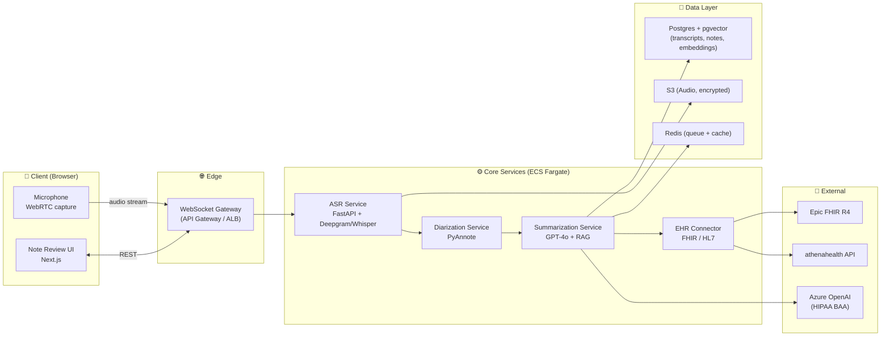

# Medics4ALL — Technical Implementation Roadmap

## Tier 1 Core MVP: English AI Medical Scribe

> Goal: Ship a production-quality English medical scribe in **9 months** with **2–3 paying pilot clinics**, on a stack that scales directly into Tier 2 (multilingual) without rewrites.

---

## 1. MVP Scope — What Ships in v1.0

### In scope (must-have for first paying customer)
| Capability | Definition of Done |
|---|---|
| **Real-time ASR (English)** | < 8% WER on conversational medical English; handles 2-speaker visits up to 45 min |
| **Speaker diarization** | Doctor / patient distinction with > 90% accuracy on 2-speaker scenes |
| **SOAP note generation** | Structured note (Subjective / Objective / Assessment / Plan) ready for clinician review in < 30 sec post-visit |
| **Editable note UI** | Web app where doctor can review, edit, sign, and export the note |
| **EHR export — 1 system** | One-click push to Epic via FHIR R4 OR PDF/HL7 export for Athena |
| **HIPAA-compliant storage** | All audio + transcripts encrypted at rest (AES-256) and in transit (TLS 1.3); BAA-ready architecture |
| **Audit trail** | Every read/write logged with user + timestamp; exportable for compliance audits |
| **Auth + multi-tenant** | SSO (Okta/Azure AD), per-clinic data isolation |

### Explicitly out of scope for MVP (Phase 2+)
- ❌ Foreign-language input (that's Tier 2)
- ❌ Mobile native apps (web-first; mobile in v1.5)
- ❌ Custom EHR integrations beyond Epic/Athena
- ❌ Voice commands ("Hey scribe, add lab order")
- ❌ Billing code suggestion (CPT/ICD auto-coding) — high-value but high-risk; defer to v2
- ❌ Telehealth platform integrations (Zoom/Teams) — v1.5

---

## 2. Technology Stack

### 2.1 ASR (Speech → Text)
| Option | Pros | Cons | Recommendation |
|---|---|---|---|
| **Whisper Large v3 (self-hosted)** | Free, fine-tunable, owns the data | GPU cost, latency, ops burden | ✅ **Primary** — fine-tune on medical English |
| **Deepgram Nova-2 Medical** | Best medical English WER, real-time API, HIPAA BAA | $0.0043/min cost, vendor lock-in | ✅ **Fallback / launch faster** |
| **AWS Transcribe Medical** | HIPAA-ready, AWS-native | Higher cost, lower accuracy than Deepgram for nuance | ❌ Not for MVP |
| **AssemblyAI Universal-2** | Good real-time, decent medical | Not specialized in medical | ⚠️ Backup option |

**Recommended path:** Launch with **Deepgram Nova-2 Medical** for speed-to-market (Month 1–6), then **migrate to fine-tuned Whisper Large v3** for cost + IP control once you have ≥ 100 hours of customer audio for fine-tuning (Month 7–9).

### 2.2 LLM (Summarization → SOAP note)
| Option | Pros | Cons | Recommendation |
|---|---|---|---|
| **GPT-4o (Azure OpenAI HIPAA)** | Best clinical reasoning, BAA available via Azure | Cost: ~$0.50–$1.50 per visit, vendor risk | ✅ **Primary for MVP** |
| **Claude 3.5 Sonnet (AWS Bedrock)** | Strong long-context, BAA via AWS | Slightly weaker medical eval scores than GPT-4 | ✅ **Fallback** |
| **Llama 3.1 70B (self-hosted)** | Free, full control, no PHI leaves your VPC | Needs A100s ($$$), eng burden, slightly weaker medical reasoning | ⏳ **Path to v2** for cost reduction |
| **MedPaLM-2 / Med-Gemini** | Best clinical accuracy in benchmarks | Not generally available, Google-only | ❌ Not viable for MVP |

**Strategy:** Start GPT-4o → add Llama 3.1 70B with medical fine-tuning at ~10K visits/month (cost crossover point).

### 2.3 Diarization
- **PyAnnote 3.1** (open-source, state-of-the-art)
- Run as separate microservice; provides speaker turns to ASR pipeline
- Fine-tune on ~50 hours of doctor-patient audio in Month 4–5

### 2.4 Backend & Infra
| Layer | Choice | Why |
|---|---|---|
| **API** | Python FastAPI | Fast, async, ML-friendly, big talent pool |
| **Real-time audio** | WebSocket + WebRTC | Standard for low-latency streaming ASR |
| **Worker queue** | Redis + Celery (or Temporal) | For async note generation jobs |
| **Database** | Postgres (RDS) + pgvector for RAG embeddings | Battle-tested, HIPAA-eligible |
| **Object storage** | S3 with SSE-KMS encryption | Audio files; lifecycle to Glacier after 30d |
| **Cloud** | AWS (us-east-1, us-west-2) | HIPAA BAA, HITRUST option, biggest healthcare ecosystem |
| **Container orchestration** | ECS Fargate (start) → EKS (when scaling) | Lower ops at first, switch when needed |
| **Monitoring** | Datadog (HIPAA tier) + Sentry | Industry standard |

### 2.5 Frontend
| Layer | Choice |
|---|---|
| **Framework** | Next.js 14 (App Router) + React 18 |
| **UI library** | shadcn/ui + Tailwind CSS |
| **State** | Zustand or TanStack Query |
| **Audio capture** | MediaRecorder API + custom WebRTC adapter |
| **Auth** | Clerk or Auth0 (HIPAA tier) |

### 2.6 RAG (Medical Knowledge Layer)
- **Vector DB**: pgvector (Postgres extension) — keeps everything in one DB
- **Embedding model**: `text-embedding-3-large` (OpenAI) or `bge-large-en-v1.5` (open)
- **Knowledge sources for MVP**:
  - ICD-10-CM (codes for assessment)
  - RxNorm (drug names + interactions)
  - SNOMED-CT (clinical terms)
  - First DataBank or Lexicomp drug DB (commercial license, ~$30K/yr — defer to v1.5)

### 2.7 EHR Integration
- **Epic**: App Orchard membership ($500–$2,500/yr) → SMART on FHIR + Epic FHIR R4 endpoints
- **Athena**: athenahealth Marketplace via athena's REST API
- **MVP shortcut**: Generate signed PDF + HL7 v2 file → email/send to clinic's intake; switch to live FHIR push by Month 9

---

## 3. Architecture (System Diagram)

---

## 4. 9-Month Build Plan (Milestones)

### Month 0 — Pre-Build (4 weeks)
- [ ] Hire / confirm: 1 ML engineer, 2 full-stack, 1 DevOps, 1 PM (founder = product + medical liaison)
- [ ] AWS HIPAA BAA signed; landing-zone account + VPC architecture
- [ ] Sign 2–3 design-partner clinics (LOI, not contract — see "Validation" below)
- [ ] Procure datasets: PhysioNet de-identified clinical conversations, MTSamples, MedDialog

### Months 1–2 — Foundation (Sprint 1–4)
- [ ] AWS landing zone (Org, Control Tower, KMS, Config, GuardDuty)
- [ ] Auth + multi-tenancy skeleton (Clerk + Postgres RLS)
- [ ] Audio capture POC: browser → S3 in real-time
- [ ] Deepgram integration → live transcripts in UI
- [ ] **Demo milestone**: live English transcription with timestamps in browser

### Months 3–4 — Core ML Pipeline (Sprint 5–8)
- [ ] PyAnnote diarization service in Fargate
- [ ] Prompt engineering for SOAP generation (GPT-4o)
- [ ] Build "transcript → SOAP" service with structured JSON output
- [ ] Editable rich-text UI (Tiptap or Lexical) for note review
- [ ] **Demo milestone**: end-to-end visit → reviewable SOAP note in under 5 min

### Months 5–6 — EHR + Compliance (Sprint 9–12)
- [ ] HIPAA-compliant audit logging across all services
- [ ] FHIR R4 client library; Epic App Orchard application submitted
- [ ] PDF/HL7 fallback path
- [ ] First **internal pilot** with 2 partner doctors (synthetic patients, then real consenting patients)
- [ ] **Demo milestone**: SOC 2 Type 1 audit kicked off

### Months 7–8 — Pilot & Hardening (Sprint 13–16)
- [ ] Deploy to first 2–3 partner clinics (5–10 providers each)
- [ ] On-call rotation; SLA = 99.5% uptime
- [ ] Latency optimization: target < 2 sec end-to-end transcription, < 30 sec note generation
- [ ] Begin Whisper fine-tuning on accumulated audio (need ~100+ hours)
- [ ] Customer success playbook + training materials

### Month 9 — GA Launch
- [ ] Public marketing site
- [ ] Sign first 3 paying customers ($199–499/provider/month tier)
- [ ] SOC 2 Type 1 report issued
- [ ] **Revenue milestone**: $20K MRR

---

## 5. Team & Org Structure (MVP Phase)

| Role | Headcount | Responsibility | Rough US Salary (loaded) |
|---|---|---|---|
| Founder / CEO (you) | 1 | Product, medical liaison, sales | — |
| ML Engineer (Lead) | 1 | ASR + LLM pipeline, model selection, fine-tuning | $200–250K |
| Full-Stack Engineer | 2 | Frontend + backend services | $160–200K each |
| DevOps / Security Engineer | 1 (0.5 FTE OK at start) | AWS, HIPAA, SOC 2, CI/CD | $180–220K |
| Clinical Advisor | 1 (consultant, ~0.2 FTE) | Note quality eval, SOAP rubric design | $100–200/hr |
| Designer (contract) | 1 (0.3 FTE) | UX for note review flow | $80–150/hr |

**Total team: 5 FTE + 2 fractional**
**Annualized burn (US): $1.0M–$1.4M/yr**

If team is in MENA/EU: cut salaries roughly in half ($550K–$750K/yr).

---

## 6. Cost Estimates

### One-time / Setup
| Item | Cost |
|---|---|
| AWS HIPAA-eligible architecture setup | $5K–$15K (consulting if needed) |
| SOC 2 Type 1 audit | $15K–$30K |
| HIPAA BAA legal review + privacy program | $5K–$15K |
| Epic App Orchard membership | $0.5K–$2.5K/yr |
| Domain, SSL, branding | $1K–$3K |
| **Total setup** | **~$30K–$70K** |

### Monthly run-rate (at 50 active providers, ~5K visits/month)
| Item | Cost / Month |
|---|---|
| AWS compute + storage | $4K–$8K |
| Deepgram API (5K visits × ~20 min × $0.0043) | $4.3K |
| Azure OpenAI (5K × ~$0.80/note) | $4K |
| Clerk + Datadog + misc SaaS | $2K |
| Salaries (5 FTE) | $80K–$110K |
| **Monthly OpEx** | **~$95K–$130K** |

### Unit economics at 50 providers ($199–499/mo tier)
- **MRR** (avg $300/provider): $15K
- ⚠️ At 50 providers, you are still **burning** ~$110K/month from runway
- **Break-even** = ~400 providers at $300 ARPU = $120K MRR (Month 18–24 target)

---

## 7. Risk Register & Mitigations

| Risk | Likelihood | Impact | Mitigation |
|---|---|---|---|
| **Note quality below clinician threshold** | High | High | Clinician-in-the-loop from day 1; quality rubric scored on every note; weekly note-eval reviews |
| **HIPAA breach / PHI leak** | Low | Catastrophic | Defense in depth: encryption, RLS, audit logs, no PHI in logs/prompts, zero-trust networking |
| **Deepgram price hike / outage** | Medium | High | Whisper fine-tune as fallback by Month 7; abstract ASR provider behind interface |
| **EHR integration delays (Epic App Orchard) ** | High | Medium | Ship with PDF/HL7 fallback first; Epic in parallel |
| **Hallucinated medications/dosages** | Medium | Catastrophic (malpractice) | Constrain LLM to RAG retrievals for drug names; mandatory clinician sign-off; flag all drug mentions for review |
| **Low ASR accuracy on accented English** | Medium | Medium | Diversify training data; ship dialect-aware fallback prompt; this is also a flywheel for Tier 2 |
| **Slow sales cycle in US healthcare** | High | High | Start with private clinics (faster cycle) before academic medical centers |

---

## 8. Quality & Evaluation Framework

You can't ship a clinical product without a measurement system. Build this **alongside** the MVP:

### Metrics dashboard (live from week 4)
| Metric | Target | Source |
|---|---|---|
| **WER (word error rate)** | < 8% on internal medical eval set | Hourly automated eval |
| **Note completeness** | > 90% of clinician-required fields populated | Rubric scored by clinical advisor |
| **Time-to-note (TTN)** | < 60 sec from visit-end to draft | Application metrics |
| **Doctor edit rate** | < 30% of words changed | UI telemetry |
| **HIPAA audit pass rate** | 100% | Quarterly internal audit |
| **Crash-free sessions** | > 99.5% | Sentry |
| **Note rejection rate** | < 5% (notes thrown out by doctor) | UI telemetry |

### Weekly clinical review
1 hour/week with clinical advisor: sample 20 random notes, score against rubric, file improvement tickets. **Do not skip.**

---

## 9. Pre-MVP Validation (Do This First!)

Before writing a single line of production code, validate:

1. **3 LOI letters of intent** from clinics willing to pilot at $X/provider/month
2. **Clinician interview script results** from 15 doctors confirming pain + willingness-to-pay
3. **One end-to-end manual demo**: hold up a phone, transcribe via Deepgram web, paste into ChatGPT with SOAP prompt, hand result to a doctor → does it pass the laugh test?
4. **Competitive walkthrough**: actually try DeepScribe + Abridge demos; document what works and what doesn't

**If you can't get 3 LOIs in 30 days, the problem is GTM, not the product. Fix that before building.**

---

## 10. Path from Tier 1 → Tier 2 (Why the Stack Choice Matters)

The Tier 1 stack is deliberately chosen so Tier 2 (multilingual) is an **extension, not a rewrite**:

| Component | Tier 1 | Tier 2 (added later) |
|---|---|---|
| ASR | Deepgram → Whisper-EN | Whisper fine-tuned on Arabic/FL dialects (same infra) |
| LLM | GPT-4o for SOAP | GPT-4o for translation + SOAP (same provider, multilingual built-in) |
| Diarization | PyAnnote | Same model, language-agnostic |
| Backend | FastAPI services | Add 2 new services: `dialect-router`, `medical-translator` |
| Frontend | Note review UI | Add language toggle + side-by-side EN/AR view |
| RAG | English ICD/SNOMED | Add Arabic medical lexicon via same pgvector |

**Estimated incremental work for Tier 2 MVP**: ~3–4 months on top of Tier 1 GA. That's the prize for picking the right stack now.

---

## 11. Decision Log (Make These Choices in Week 1)

| Decision | Recommended | Why |
|---|---|---|
| Self-host or API for ASR? | **API first (Deepgram), self-host by Month 9** | Speed-to-market beats cost optimization at this stage |
| Cloud provider? | **AWS** | Healthcare ecosystem + BAA + HITRUST option |
| LLM provider? | **Azure OpenAI (GPT-4o)** | HIPAA BAA, best medical reasoning |
| Frontend framework? | **Next.js 14** | SSR + great DX + huge talent pool |
| Database? | **Postgres + pgvector** | One DB for all needs at MVP scale |
| Real-time protocol? | **WebSocket** | Simpler than WebRTC at MVP; revisit when adding video |
| Auth? | **Clerk** | Fastest to ship; HIPAA tier exists |
| First EHR? | **Athena** for first pilot, **Epic** in parallel | Athena is faster to integrate; Epic has the volume |
| Open-source license for any code we open? | **None at MVP** | Keep IP private until product-market fit |

---

## 12. The Single Question That Determines Success

> **"Would the doctor at a real clinic, on a real day, with a real patient, sign the note we generate without major edits?"**

If yes — you have a product.
If no — keep iterating on the eval rubric until yes.

Everything else (pricing, marketing, EHR integrations, multilingual) is solvable. **Note quality is not negotiable.**
